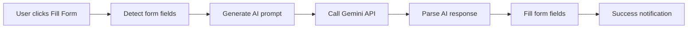

# 🤖 AI Fake Filler - Chrome Extension

[](https://chrome.google.com/webstore)
[](https://ai.google.dev/)
[](https://ai-fake-filler.netlify.app)
[](./LICENSE)
[](https://github.com/salekmasudparvez1/ai-fake-filler/stargazers)

> 🚀 **AI-powered Chrome extension that automatically fills web forms with realistic fake data using Google's Gemini API**

Perfect for developers, testers, and anyone who needs to quickly populate forms with realistic test data. Save time and boost productivity with intelligent form filling powered by artificial intelligence.

## ✨ Features

🎯 **Smart Form Detection** - Automatically identifies and fills input fields, textareas, and form elements  
🧠 **AI-Powered Data Generation** - Uses Google's Gemini AI to create contextually appropriate fake data  
🔒 **Secure API Key Storage** - Your API key is stored locally in Chrome's encrypted storage  
⚡ **One-Click Form Filling** - Fill entire forms instantly with a single click  
🌐 **Universal Compatibility** - Works on any website with forms  
🎨 **Modern UI Design** - Clean, intuitive popup interface with gradient design  
📱 **Responsive Design** - Optimized for all screen sizes  

## 🚀 Live Demo

**Try it now:** [https://ai-fake-filler.netlify.app](https://ai-fake-filler.netlify.app)

Experience the power of AI-driven form filling in action! The live demo showcases the extension's capabilities and user interface.

## 📥 Quick Start

### 1. Get Your Gemini API Key
- Visit [Google AI Studio](https://aistudio.google.com/app/apikey)
- Sign in with your Google account
- Generate a new API key for Gemini
- Copy the API key (keep it secure!)

### 2. Install the Extension
```bash
# Clone the repository
git clone https://github.com/salekmasudparvez1/ai-fake-filler.git
cd ai-fake-filler

# Load in Chrome
# 1. Open chrome://extensions/
# 2. Enable "Developer mode" (top right toggle)
# 3. Click "Load unpacked" and select this folder
```

### 3. Configure & Use
1. Click the extension icon in Chrome toolbar
2. Enter your Gemini API key and click "Save API Key"
3. Navigate to any webpage with a form
4. Click "Fill Form" button
5. Watch as AI fills your form with realistic data! ✨

## 🛠️ How It Works



1. **Field Detection**: Scans the page for fillable form elements
2. **Context Analysis**: Analyzes field names, types, and placeholders
3. **AI Generation**: Sends context to Gemini AI for realistic data generation
4. **Smart Filling**: Populates fields with contextually appropriate data
5. **Event Triggering**: Fires proper events to ensure compatibility

## 🎯 Use Cases

- **Web Development**: Quickly test forms during development
- **QA Testing**: Generate test data for quality assurance
- **Demo Preparation**: Populate forms for presentations and demos
- **Form Automation**: Streamline repetitive form filling tasks
- **Prototyping**: Add realistic data to prototypes and mockups

## 🔧 Technical Details

### Architecture
- **Manifest V3**: Latest Chrome extension API
- **Service Worker**: Background script for extension lifecycle
- **Content Script**: Form detection and filling logic
- **Popup Interface**: Modern, responsive user interface

### File Structure
```
ai-fake-filler/
├── manifest.json          # Extension configuration
├── popup.html            # Extension popup interface
├── popup.js              # Popup functionality & API management
├── content.js            # Form filling logic & Gemini integration
├── background.js         # Service worker
├── styles.css            # Visual feedback styles
├── icons/                # Extension icons (16px, 48px, 128px)
└── README.md            # Documentation
```

### Supported Field Types
- Text inputs (name, address, company, etc.)
- Email fields
- Phone number fields
- Date fields
- Number inputs
- Textareas
- And more!

## 🔒 Privacy & Security

- ✅ API keys stored locally in Chrome's encrypted storage
- ✅ No data sent to third parties (except Google Gemini API)
- ✅ Minimal permissions requested
- ✅ Open source and transparent
- ✅ No user data collection or tracking

## 🤝 Contributing

We welcome contributions! Please see our [Contributing Guidelines](CONTRIBUTING.md) for details.

### Quick Contributing Guide
1. Fork the repository
2. Create a feature branch: `git checkout -b feature/amazing-feature`
3. Make your changes and test thoroughly
4. Commit: `git commit -m 'Add amazing feature'`
5. Push: `git push origin feature/amazing-feature`
6. Open a Pull Request

## 📄 License

This project is licensed under the MIT License - see the [LICENSE](LICENSE) file for details.

## 🌟 Show Your Support

If you find this project helpful, please consider:
- ⭐ Starring the repository
- 🐛 Reporting bugs or requesting features
- 🤝 Contributing to the codebase
- 📱 Sharing with fellow developers

## 📞 Support & Contact

- 🐛 **Bug Reports**: [GitHub Issues](https://github.com/salekmasudparvez1/ai-fake-filler/issues)
- 💡 **Feature Requests**: [GitHub Issues](https://github.com/salekmasudparvez1/ai-fake-filler/issues)
- 📧 **General Questions**: Open an issue for discussion

## 🚀 What's Next?

- [ ] Chrome Web Store publication
- [ ] Firefox extension support
- [ ] Advanced field recognition
- [ ] Custom data templates
- [ ] Bulk form processing
- [ ] API rate limiting improvements

---

<div align="center">

**Made with ❤️ by [Salek Masud Parvez](https://github.com/salekmasudparvez1)**

[⭐ Star this repo](https://github.com/salekmasudparvez1/ai-fake-filler/stargazers) | [🐛 Report Bug](https://github.com/salekmasudparvez1/ai-fake-filler/issues) | [✨ Request Feature](https://github.com/salekmasudparvez1/ai-fake-filler/issues)

</div>